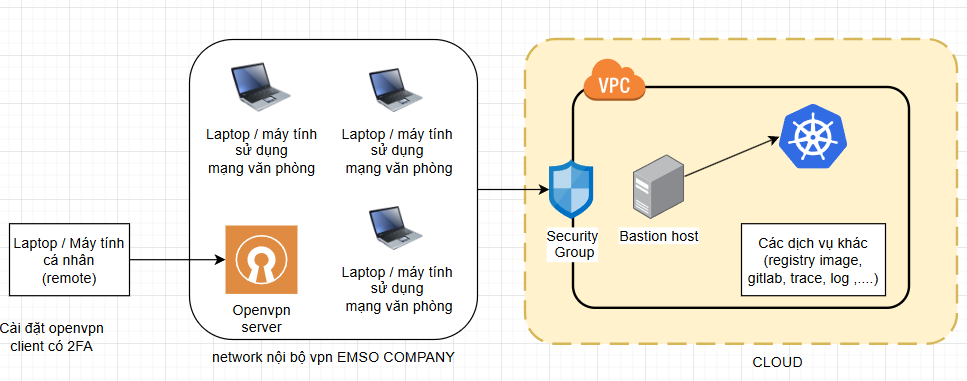
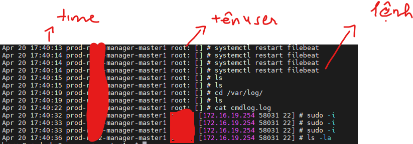

## 🧱 Tổng thể mô hình xác thực truy cập vào hệ thống CLOUD EMSO
Hệ thống này áp dụng mô hình bảo mật **VPN nội bộ + Bastion Host**, trong đó chỉ người dùng được cấp profile của vpn và đã xác thực VPN (có 2FA) mới có thể truy cập Bastion, và từ đó mới đến cụm Kubernetes trên cloud CMC gõ lệnh. Khi người dùng ở bên ngoài ko vào VPN là ko access được cluster và sử dụng các dịch vụ trên cloud CMC được.

## 🔄 Luồng truy cập
  

## 🧩 Chi tiết từng thành phần

### 1. Laptop / Máy tính cá nhân (remote)

- Là thiết bị cá nhân của nhân viên làm việc từ xa khi làm việc ở nhà hoặc nơi khác ko có mặt tại công ty.
- Cần:
  - **Cài đặt OpenVPN Client**
  - **Đăng nhập bằng xác thực hai yếu tố (2FA)**
- Sau khi kết nối VPN, thiết bị được gán IP nội bộ và có thể truy cập hệ thống nội bộ.

### 2. Máy chủ OPENVPN-SERVER

- Cài đặt phiên bản OpenVPN Access server 
- Hướng dẫn chi tiết cài đặt dịch vụ OpenVPN (gửi kèm theo file docs + hướng dẫn active sửa license)
- Yêu cầu có server đặt ở công ty (ko cần máy chủ quả lớn 2-4Gb RAM, CPU 4core) và IP Public công ty phải là IP tĩnh
- Hướng dẫn vẫn hành cơ bản (tạo sửa xóa quyền truy cập trên web quản trị, cấp phát profile, revoke quyền, gia hạn quyền truy cập, check log truy cập)

### 3. Máy chủ Bastion Host
Đóng vai trò là điểm trung gian (Jump Server) giữa người dùng và hệ thống trong Kubernetes. 
- Cài đặt gì bên bastion host:
    + Setup security group chỉ cho phép từ mạng cty EMSO kết nối với bastion (tức là nhân viên EMSO phải vpn vào mới kết nối được tới bastion host)

    + Setup Log-command vào máy chủ Bastion host để người dùng gõ lệnh gì thì sẽ có dạng log như này (bao gồm cả tài khoản root) giống như hình
      

    + Setup hệ thống cảnh báo Alert khi có người dùng login vào bastion host [ gửi kèm theo file docs + hướng dẫn xử lý cảnh báo bắn về API telegram (nội dung gửi tiếng Việt tường minh bao gồm (tên user, địa chỉ IP login vị trí, thời gian login) ]

    + Tạo tài khoản USER login cho thành viên muốn access vào server bastion host thông qua ssh key và cấp quyền chạy lệnh cluster k8s thông qua API config của k8s theo cách (gửi kèm docs file + hướng dẫn vận hành)